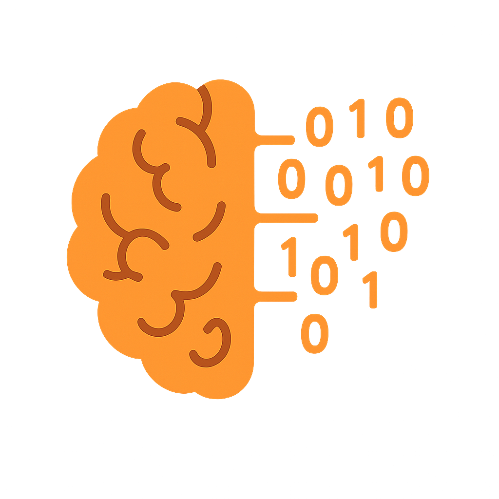

# PIE Workbench

A modern GUI for the Parkinson's Insight Engine (PIE) ecosystems.



## Overview

PIE Workbench is a user-friendly, modular desktop application designed for clinical researchers and data scientists focusing on Parkinson's Disease. It provides advanced analytics (Machine Learning & Statistics) without requiring users to write code.

**Inspiration:** WEKA (functionality) meets Modern Web Apps (aesthetics/usability).

## Features

### 🏠 Project Hub
- Create new analyses or open existing projects
- Configure disease context and data paths
- Project state management with save/load functionality

### 📊 Data Ingestion
- Load PPMI data with automatic modality detection
- Visualize data health with missingness heatmaps
- Support for multiple data modalities:
  - Subject Characteristics
  - Medical History
  - Motor Assessments (MDS-UPDRS)
  - Non-Motor Assessments
  - Biospecimen

### 🧠 ML Engine
- Visual pipeline builder for machine learning workflows
- Target variable selection with auto-detection
- Feature selection methods (FDR, K-Best, RFE)
- Leakage control with drag-and-drop interface
- Model comparison with multiple algorithms
- Auto-pilot and Expert modes

### 📈 Statistical Workbench
- Automatic statistical test selection
- T-tests, ANOVA, Chi-Square tests
- Correlation analysis (Pearson, Spearman, Kendall)
- Survival analysis with Kaplan-Meier curves
- Log-rank tests for group comparisons

### 📋 Results
- Interactive ROC curves and confusion matrices
- Feature importance visualizations
- Model comparison tables
- Export and report generation

## Architecture

PIE Workbench uses a hybrid desktop architecture:

```
┌─────────────────────────────────────────────────────┐
│                    User Interface                    │
│              (Electron + React + TypeScript)         │
└─────────────────────────┬───────────────────────────┘
                          │ HTTP/REST (port 8100)
                          ▼
┌─────────────────────────────────────────────────────┐
│                   Backend API                        │
│                    (FastAPI)                         │
└─────────────────────────┬───────────────────────────┘
                          │
                          ▼
┌─────────────────────────────────────────────────────┐
│              PIE / PIE-clean Libraries               │
│        (Data Loading, Processing, ML, Stats)         │
└─────────────────────────────────────────────────────┘
```

## Installation

### Prerequisites

- Node.js 18+ and npm
- Python 3.9+
- PPMI data (download from [ppmi-info.org](https://www.ppmi-info.org))

### Setup

1. **Clone the repository (including submodules):**
   ```bash
   git clone --recurse-submodules https://github.com/MJFF-ResearchCommunity/PIE-Workbench.git
   cd PIE-Workbench
   ```

   Already cloned without `--recurse-submodules`? Pull the submodules now:
   ```bash
   git submodule update --init --recursive
   ```

2. **Install frontend dependencies:**
   ```bash
   npm install
   ```

3. **Set up Python virtual environment:**
   ```bash
   cd backend
   python -m venv venv
   source venv/bin/activate  # On Windows: venv\Scripts\activate
   pip install -r requirements.txt
   ```

4. **Install PIE, PIE-clean, and their dependencies:**
   ```bash
   # Still in backend/ with venv activated

   # PIE's own dependencies (endgame-ml, shap, statsmodels, ...).
   # Required — PIE's setup.py does not declare install_requires, so
   # `pip install -e ../lib/PIE` alone is NOT enough.
   pip install -r ../lib/PIE/requirements.txt

   # The library packages themselves, editable so updates to the
   # submodules reflect without a reinstall.
   pip install -e ../lib/PIE
   pip install -e ../lib/PIE-clean
   cd ..
   ```

### Running the Application

**Option 1: Development mode (recommended for development)**

Open two terminals:

```bash
# Terminal 1: Start the backend (port 8100)
cd backend
source venv/bin/activate
uvicorn main:app --reload --port 8100

# Terminal 2: Start the frontend (port 5173)
npm run dev:react
```

Then open http://localhost:5173 in your browser, or run the Electron app:
```bash
npm run dev:electron
```

**Option 2: Using npm scripts**

```bash
# Backend only (requires venv to be activated first)
npm run backend

# Frontend only
npm run dev:react

# Electron + Frontend (backend must be running separately)
npm run dev
```

**Option 3: Full Electron app**

Make sure the backend is running first, then:
```bash
npm start
```

### Verifying the Setup

1. **Check backend is running:**
   ```bash
   curl http://127.0.0.1:8100/api/health
   # Should return: {"status":"healthy","version":"1.0.0"}
   ```

2. **Check frontend is running:**
   Open http://localhost:5173 in your browser

### Building for Production

```bash
npm run build:electron
```

This creates distributable packages in the `release/` directory.

## Project Structure

```
PIE-Workbench/
├── package.json              # Electron/React dependencies
├── src/                      # React Frontend
│   ├── components/           # Reusable UI components
│   ├── views/                # Main screens
│   ├── services/             # API client
│   └── store/                # State management (Zustand)
├── backend/                  # Python FastAPI Server
│   ├── main.py               # Entry point
│   ├── venv/                 # Python virtual environment
│   ├── requirements.txt      # Python dependencies
│   ├── api/                  # API endpoints
│   │   ├── project.py        # Project management
│   │   ├── data.py           # Data ingestion
│   │   ├── analysis.py       # ML operations
│   │   └── statistics.py     # Statistical tests
│   └── core/                 # Adapter layer
│       ├── abstract_loader.py
│       └── ppmi_loader.py
├── electron/                 # Electron main process
│   ├── main.js               # Main process entry
│   └── preload.js            # Preload script
├── lib/                      # Git submodules
│   ├── PIE/                  # PIE ML library
│   └── PIE-clean/            # Data cleaning library
├── public/                   # Static assets
│   └── icon.png              # Application icon
└── resources/                # Electron resources
```

## Technology Stack

- **Frontend:** React, TypeScript, Tailwind CSS, Framer Motion
- **Charts:** Recharts
- **State Management:** Zustand
- **Backend:** FastAPI (Python) on port 8100
- **Desktop:** Electron
- **ML Libraries:** PyCaret, scikit-learn, lifelines

## Modular Design


PIE Workbench uses the Adapter Pattern to support future diseases and data sources:

```python
class AbstractDataLoader(ABC):
    @abstractmethod
    def detect_modalities(self, path: str) -> List[Dict]
    
    @abstractmethod
    def load_data(self, path: str, modalities: List[str]) -> DataFrame
```

To add support for a new dataset (e.g., ADNI for Alzheimer's):

1. Create `backend/core/adni_loader.py`
2. Implement the `AbstractDataLoader` interface
3. Register in the API router

## Troubleshooting

### Port already in use
If you see "address already in use" error:
```bash
# Find and kill the process using port 8100
lsof -i :8100
kill -9 <PID>
```

### File watcher limit reached
If Vite crashes with ENOSPC error, the backend venv is being watched. This is fixed in `vite.config.ts` but you can also increase the limit:
```bash
echo fs.inotify.max_user_watches=524288 | sudo tee -a /etc/sysctl.conf
sudo sysctl -p
```

### Module not found errors
Make sure you've installed PIE and PIE-clean in the backend venv:
```bash
cd backend
source venv/bin/activate
pip install -e ../lib/PIE
pip install -e ../lib/PIE-clean
```

## Contributing

Contributions are welcome! Please read our contributing guidelines before submitting PRs.

## License

This project is licensed under the MIT License - see the LICENSE file for details.

## Acknowledgments

- PPMI (Parkinson's Progression Markers Initiative)
- The Michael J. Fox Foundation
- PIE and PIE-clean library contributors

## Support

For questions or issues, please open a GitHub issue or contact the maintainers.
